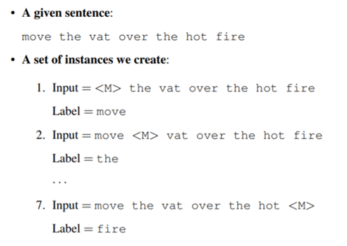
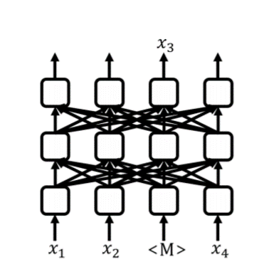
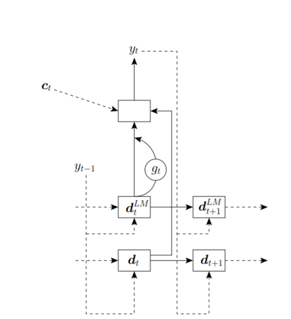
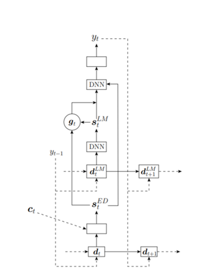

# Language Modeling

## why language modeling?  
language model, together with acoustic model and pronunciation model, has been a key component in a traditional ASR pipeline; but recent advances in end-to-end ASR systems do not necessarily require a language model; yet we still need them for:
  - capturing relationships amongst charactors, word-pieces, words, or sentence-pieces; essential in CTC-based methods (as an abundance of \<blank\> and repeated parts breaks the connections of different components)
  - making use of massive unpaired text data

## how to evaluate a language model?
  - by [perplexity](https://en.wikipedia.org/wiki/Perplexity); which could be easily calculated through nll-loss;
  - by performance gain of the Machine Translation, Automatic Speech Recognition, etc. system it is integrated to. 

## how to utilize language models in ASR systems?
  - rescoring:  
  ASR models propose several sequences with scores; language models rescore them; pick the best sequence.  
    - beam search + second pass rescoring  
    after proposing a set of sequences; both uni-directional LMs and bi-directional LMs can be used for rescoring.  
    bi-directional LMs sounds better than uni-directional LMs; but only marginal gain can be observed, until a [Sentence Rescoring Method](https://arxiv.org/abs/1905.06655) using BERT was able to achieve a significant improvement; as they could _consider the interaction between the past and the future words on the biLM_.  
    in order to rescore a sentence, they create a set of series:  
      
    and calculate probabilty for each masked word:  
      
    after compensating for its length, the log-probabilty is then combined with ASR scores to propose a best sequence.
    - lattice rescoring  
    save resources significantly; fit for n-gram language models;  
    [this work](http://mi.eng.cam.ac.uk/~xc257/papers/RNNLM_latrescore.pdf) and [this work in Kaldi](http://danielpovey.com/files/2018_icassp_lattice_pruning.pdf) proposes novel methods to cluster RNNLM states to fit into lattice rescoring techniques  
    
  - augmented ASR scorings:  
  ASR models and Language models give weighted scores together; propose sequences accodingly.
    - shallow fusion  
    Aka. linear/ log-linear interpolation (depending on wether to add log-probs or logaddexp log-probs);  
    only the scores of the ASR model and the LM are combined.  
    best performance; easiest to implement;  
    - deep fusion  
      
    combines hidden states together; train separately
    - cold fusion  
      
    combines hidden states together; ASR model trained together with a pretrained language model;

## training and decoding theories  
  - count-based models (n-grams):  
  - lstm-based models:  
  - self-attention based models  

## toolkits  
  - [KenLM](https://kheafield.com/code/kenlm/) and its [python interface](https://github.com/kpu/kenlm) is a great place to get started on n-gram models
  - [gensim](https://github.com/rare-technologies/gensim) is great for document-level manipulation (say, when preprocessing)
  - [fairseq](https://fairseq.readthedocs.io/en/latest/tasks.html#language-modeling) lstm or transformer
  - [pytorch-transformer](https://github.com/huggingface/pytorch-pretrained-BERT) (bert)

[back](index.md)
